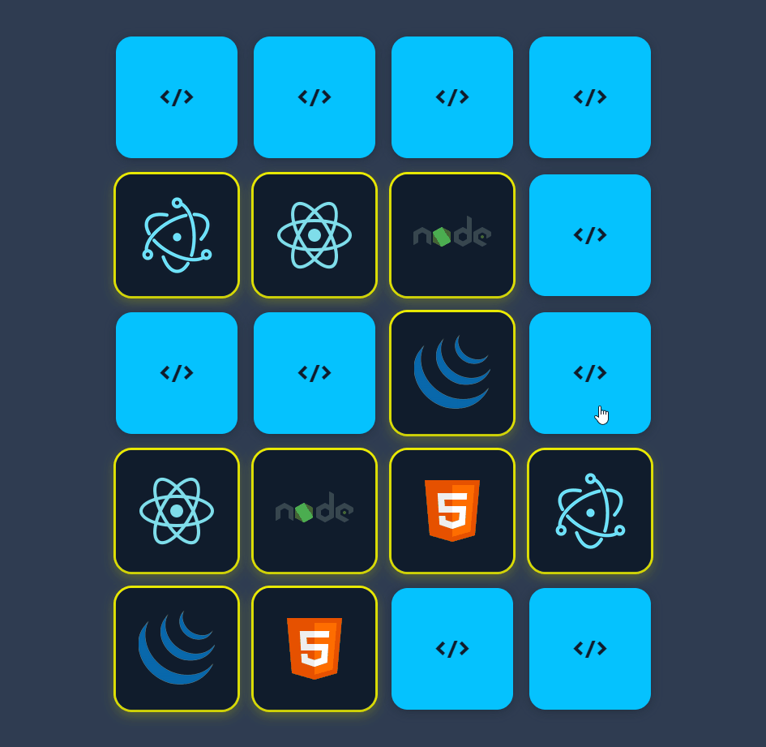

🎮 Exemplo de um Jogo da Memória utilizando JavaScript.

➡️ [Acesse a página clicando aqui](https://gabrielcostarep.github.io/Jogo-da-Memoria/) ⬅️

  

 

## 🚀 Tecnologias

Este projeto foi desenvolvido com as seguintes tecnologias:

- ✔️ JavaScript
- ✔️ HTML
- ✔️ CSS

 

Feito por Gabriel Costa 👋🏾 [Veja meu Linkedin](https://www.linkedin.com/in/gabrielcostadev/)
